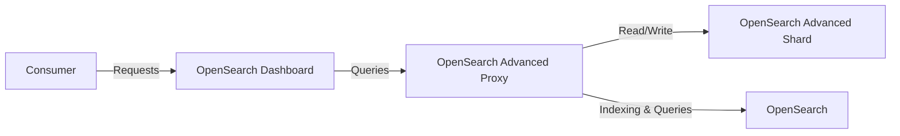

# OpenSearch Advanced Proxy

The OpenSearch Advanced Proxy project aims to provide an extendable proxy for OpenSearch, enhancing its capabilities with custom plugins and external storage solutions.

## Disclaimer

1. This project is not an official OpenSearch project and is not supported by OpenSearch. It is a community project developed and maintained by community members.
2. The project is currently in the early stages of development and is not recommended for production use.
3. APIs and configurations are subject to change.

## Overview

This project addresses the challenge of implementing a robust logging system for infrastructure and custom software solutions. While OpenSearch offers an excellent platform for log storage and visualization, it can be resource-intensive and costly for long-term data retention. Our solution integrates OpenSearch with external storage, optimizing performance and cost-effectiveness.

### Problem Statement

- Need for a scalable and efficient logging system for infrastructure and custom applications.
- OpenSearch is resource-intensive for long-term log storage, leading to high maintenance costs.

### Proposed Solution

- Leverage OpenSearch for its strengths in log indexing and visualization.
- Extend OpenSearch capabilities with custom plugins for enhanced functionality.
- Integrate external storage solutions for efficient long-term log storage.

### Components

- **OpenSearch Dashboard**: Provides a user interface for log search and visualization.
- **OpenSearch Advanced Proxy**: Serves as a proxy to extend OpenSearch functionality, offering an API for log searches and acting as a gateway for infrastructure and software solutions.
- **OpenSearch Advanced Shard**: Facilitates log storage in various formats and enables efficient querying.
- **OpenSearch**: Utilized for indexing and storing hot and warm data.

## Architecture

The architecture facilitates a streamlined flow of data and requests:



## Features

- **Custom Storage Integration**: Seamlessly integrate with various storage solutions for long-term data retention.
- **Advanced Querying**: Enhanced querying capabilities, offering flexibility and efficiency.
- **Scalability**: Designed to scale horizontally, accommodating growing data and user base.
- **Cost-Effective**: Reduces the overall cost of ownership by optimizing resource utilization.

## Installation

### Prerequisites
- Docker
- Docker Compose
- Make
- Git

### Steps
```bash
git clone <repository-url>
cd <repository-name>
make 
```

## Usage

After service startup, the OpenSearch Dashboard is available at `http://localhost:5601`.
You could now play around with custom index patterns and dashboards.
Go to the stack management page and create a new index pattern with the name `infrastructure` and the time field `datetime`.
Afterward, you could go to Discover and search for `*` to see all available logs, in case nothing appeared please extend a search interval.
In case you want to change the default configuration, please check for a Configuration section.

## Configuration

By default application setup to discover configuration in the `.local` directory.
To initialize the configuration, please run the following command in the project
```bash
make configure
```
This will copy the configuration files from the `examples/config` directory to the `.local` directory.
This will copy the configuration files from the `examples/config_shared` directory to the `.local` directory.

### Main Config Structure
```yaml
version: 1 # Version of the configuration file
logs:
  - index: example # Index name to create in OpenSearch Dashboard
    discovery:
      type: file # Index configuration type (only file is supported currently)
      location: .local/config/logs # Location of the configuration file
```

### Log Configuration File Structure
```yaml
version: 1 # Version of the configuration file
provider: webSocketServer # Provider type (jsonLogFile and webSocketServer are supported)
providerConfig:
  bindAddress: 0.0.0.0:8080  # Provider configuration depends on the provider type
timestamp:
  field: datetime # Timestamp field name used for sorting and filtering
fields:
  datetime: 
    type: date # Field type supported by OpenSearch
    searchable: true # Field configuration for OpenSearch
    aggregatable: true # Field configuration for OpenSearch
  message:
    type: text
    searchable: true
    aggregatable: false
```

The same approach is used for the `shard` service, entrypoint located in the `.local/shard_config/config.yaml` file.

## Contributing

We welcome contributions!
- **Reporting Issues**: Submit any bugs or issues through the project's issue tracker.
- **Feature Requests**: Feel free to suggest new features or enhancements.
- **Pull Requests**: Pull requests are always welcome but discuss major changes in an issue first.

## License

This project is licensed under the [MIT License](LICENSE) - see the LICENSE file for details.
